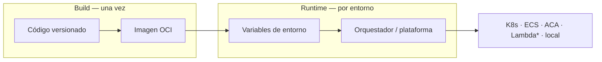

# M02 — Docker avanzado y diseño cloudnative

[← Página anterior](../M01-entorno-codespace-kind/M01-02-aplicacion-demo.md) · [Siguiente página →](M02-01-adaptacion-cloudnative.md)

> [!NOTE]
> **Cómo funciona este módulo.** Primero lees la **teoría y el contexto** (este README), después sigues la **demostración guiada** que hace el formador en clase, y por último practicas en los **laboratorios** M02-01 y M02-02.

## Qué aprenderás

Al terminar este módulo serás capaz de:

- Explicar la diferencia entre **configuración** (cambia según entorno) y **código** (igual en todos los entornos).
- Transformar una aplicación con parámetros embebidos en una app alineada con la [metodología 12-Factor](../../docs/12-factor-app.md).
- Distinguir **liveness** (`/health`) y **readiness** (`/ready`) y por qué los orquestadores cloud los usan.
- Leer y escribir un `Dockerfile` **multistage** con usuario no-root y capas optimizadas para caché.
- Argumentar cuándo una optimización aporta seguridad, tamaño o velocidad de build — no solo MB en disco.

## Contexto: qué trae M01 y qué resuelve M02

En **M01** levantaste la app demo en Docker Compose y viste que `api.py` contenía URLs y credenciales **dentro del código**. Eso funciona en un único entorno de laboratorio, pero en producción suele haber **dev**, **staging** y **prod** — cada uno con distinta base de datos, distinto Redis y distintos secretos.

Si la URL de Postgres está hardcodeada, **cada cambio de entorno obliga a recompilar la imagen**. Eso rompe dos ideas clave del mundo cloudnative:

1. **Imagen inmutable** — construyes una vez, despliegas muchas veces.
2. **Configuración externa** — el mismo artefacto recibe distinta config en runtime.

M02 cierra esa brecha en la **capa contenedor**: defines una imagen portable y dejas que cada plataforma de despliegue inyecte su configuración. Más adelante verás Kubernetes en profundidad; el diseño que haces aquí sirve igual para **ECS**, **Azure Container Apps**, **Cloud Run** o un **compose local**.



*\* Lambda y funciones serverless no siempre usan Docker; cuando sí, la misma regla aplica: config fuera del paquete.*

## Teoría

### Configuración vs código: diseñar para despliegues diversos

El objetivo no es aprender la sintaxis de un orquestador concreto, sino **separar lo que viaja en la imagen** de **lo que cambia en cada entorno**. Esa separación es lo que hace tu contenedor reutilizable.

| | **Código / artefacto** | **Configuración / entorno** |
|---|------------------------|----------------------------|
| **Qué es** | Lógica, binarios, dependencias empaquetadas | URLs, puertos, credenciales, feature flags |
| **Cuándo cambia** | Con cada release o versión | Con cada entorno (dev, staging, prod) o redeploy |
| **Dónde se define** | Repositorio de código, pipeline de build | Plataforma de ejecución en runtime |

**Dónde vive en la arquitectura del contenedor**

| Capa | Rol |
|------|-----|
| **Imagen (read-only)** | Código, runtime, librerías — **igual en todos los sitios** |
| **Variables de entorno** | Contrato estándar entre tu app y cualquier plataforma |
| **Montajes / secretos del orquestador** | Cómo cada cloud entrega esas variables al contenedor |

Tu app **solo debe leer configuración del entorno del proceso** (`os.environ`, equivalentes en otros lenguajes). No le importa si quien la rellenó fue Docker Compose, Kubernetes, ECS task definition, Azure Container Apps settings o un sidecar de secrets manager.

**Cómo inyecta config cada tipo de despliegue** (misma app, distinto mecanismo):

| Entorno | Quién inyecta la config | Tu responsabilidad en la imagen |
|---------|-------------------------|----------------------------------|
| **Docker / Compose local** | `environment`, `env_file` | Leer `DATABASE_URL`, `PORT`, etc. del entorno |
| **Kubernetes** | Manifiestos, ConfigMaps, Secrets, operadores | Mismos nombres de variable; probes en `/health` y `/ready` |
| **AWS ECS / Fargate** | Task definition, Secrets Manager, SSM | Misma imagen; variables en la definición de tarea |
| **Azure Container Apps / AKS** | Variables de app, Key Vault references | Misma imagen; secretos referenciados en la plataforma |
| **AWS Lambda (contenedor)** | Env vars de la función | Imagen delgada + config 100 % externa |
| **Cloud Run / App Service** | Config de revisión / slot | Puerto vía `$PORT` (convención habitual) |

> [!IMPORTANT]
> **Externalizar no significa commitear secretos.** Los passwords viven en el **sistema de secretos de la plataforma** (vault, secret store, variables cifradas del orquestador). En el lab usarás un fichero local gitignored como **simulación** de lo que en producción gestionaría la plataforma.

**Principio de diseño:** si mañana migras de Kubernetes a ECS, **no recompilas** — cambias quién rellena las variables. Por eso M02 trabaja la imagen y el contrato de env vars antes de profundizar en un orquestador concreto (Kubernetes, en este curso).

### Los 12 factores relevantes para este módulo

La metodología **[12-Factor App](../../docs/12-factor-app.md)** resume buenas prácticas para apps en la nube. De momento te interesan tres (detalle completo en la doc de referencia):

| Factor | Idea en una frase | Qué haces en la capa contenedor |
|--------|-------------------|----------------------------------|
| **III — Config** | Toda config en el entorno | La app lee variables; la imagen no lleva URLs ni passwords → [factor III](../../docs/12-factor-app.md#iii--config) |
| **IX — Disposability** | Arranque rápido y parada limpia | Endpoints `/health` y `/ready` estables → [factor IX](../../docs/12-factor-app.md#ix--disposability) |
| **XI — Logs** | Logs como flujo de eventos | *(observabilidad — módulo posterior)* → [factor XI](../../docs/12-factor-app.md#xi--logs) |

### Health vs Ready: contrato con cualquier orquestador

Plataformas de contenedores (Kubernetes, ECS con health checks, balanceadores managed, etc.) distinguen dos preguntas:

| Probe | Pregunta | Endpoint típico | Si falla… |
|-------|----------|-----------------|-----------|
| **Liveness** | ¿El proceso sigue vivo? | `GET /health` | Reinicia el contenedor |
| **Readiness** | ¿Puede recibir tráfico? | `GET /ready` | Lo saca del balanceador (pero no lo mata) |

**Ejemplo:** la API arranca pero Postgres aún no está listo. `/health` responde 200 (Python funciona), pero `/ready` responde 503 (sin DB no debe recibir peticiones `/work`). Cuando Postgres esté up, `/ready` pasará a 200.

> [!TIP]
> **Regla práctica:** `/health` debe ser barato (sin llamadas externas). `/ready` puede comprobar dependencias críticas (DB, cache, cola).

### Imágenes Docker: monolito vs multistage

Un **Dockerfile monolítico** hace todo en una sola imagen: instala dependencias, copia código y ejecuta. Es simple de leer, pero la imagen final incluye **todo lo del build** (caché pip, capas intermedias innecesarias) y suele correr como **root**.

Un **multistage build** usa varias etapas (`AS builder`, `AS runtime`):

```text
┌─────────────────┐     ┌─────────────────┐
│  Stage builder  │     │  Stage runtime  │
│  pip install    │ ──► │  solo runtime   │
│  (descartado)   │     │  USER app       │
└─────────────────┘     └─────────────────┘
         │                       │
         └──── imagen final ─────┘
              (más limpia)
```

Beneficios habituales:

- **Seguridad** — usuario no-root (`USER app`).
- **Caché** — `requirements.txt` antes que `api.py` → rebuilds más rápidos en CI.
- **Tamaño** — a veces menor; con bases `slim` la diferencia en MB puede ser modesta, pero la separación de responsabilidades sigue siendo buena práctica.

> [!WARNING]
> **Multistage no siempre reduce muchos MB** con imágenes `python:3.12-slim`. El valor pedagógico aquí es la **estructura** (builder/runtime, no-root, orden de capas), no solo el número en `docker images`.

### Anti-patrón (M01) vs buena práctica (M02)

| Área | Anti-patrón | Buena práctica (contenedor portable) |
|------|-------------|--------------------------------------|
| Configuración | URLs y passwords en el código fuente | Lectura desde variables de entorno |
| Secretos | Credenciales en el repositorio | Secret store / inyección de la plataforma |
| Salud | Sin endpoints o uno genérico ambiguo | `/health` (liveness) + `/ready` (readiness) |
| Imagen | Un stage, proceso root | Multistage, usuario no privilegiado |
| Despliegue | Rebuild por cada entorno | Una imagen, N entornos con distinta config |

## Demostración guiada

> Recorrido que hace el formador en vivo (tono descriptivo).

1. En el editor se abre `infra/app/api/api.py` y se señalan las constantes `DATABASE_URL`, `REDIS_URL` y `API_PORT` — restos del estilo M01.
2. Se muestra la versión refactorizada: `import os` y lectura desde entorno; se explica por qué `DATABASE_URL` no tiene valor por defecto (fallar pronto si falta config).
3. Se añade o revisa el endpoint `/ready` y, con `curl`, se contrasta respuesta 200 frente a 503 al parar Postgres con Compose.
4. Se abre `infra/.env.example`, se copia a `.env` y se modifica `SERVICE_NAME`; tras recrear solo `demo-api`, el JSON de `/health` refleja el nuevo nombre **sin** reconstruir la lógica de negocio.
5. En terminal se ejecuta `./scripts/image-size-compare.sh`: aparecen dos filas (legacy vs multistage). El formador comenta MB, capas y el `uid=10001` dentro del contenedor.
6. Se cierra con la idea portable: «Esta misma imagen y los mismos nombres de variable valen en Compose hoy, en Kubernetes en el curso, o en ECS/ACA mañana — solo cambia quién rellena el entorno».

## Antes de practicar

Comprueba que tienes:

| Requisito | Comando / comprobación |
|-----------|------------------------|
| Stack M01 operativo o scripts listos | `./scripts/lab-up.sh` |
| Clúster kind (para más adelante) | `./scripts/kind-up.sh` |
| Editor en la carpeta del repo | `/workspaces/kubernetes-cloudnative-gitops-301` |

## Ahora practica tú

| Lab | Título | Qué harás | Temario |
|-----|--------|-----------|---------|
| M02-01 | [Adaptación cloudnative](M02-01-adaptacion-cloudnative.md) | Externalizar config, `/ready`, variables de entorno | LAB 1 |
| M02-02 | [Optimización de imágenes](M02-02-optimizacion-imagenes.md) | Multistage, no-root, comparar tamaños | LAB 2 |

→ Empieza por **[M02-01 — Adaptación cloudnative](M02-01-adaptacion-cloudnative.md)**.

Tras M02-02 continúa con **[M03 — Kubernetes](../M03-kubernetes-desarrolladores/README.md)**.
